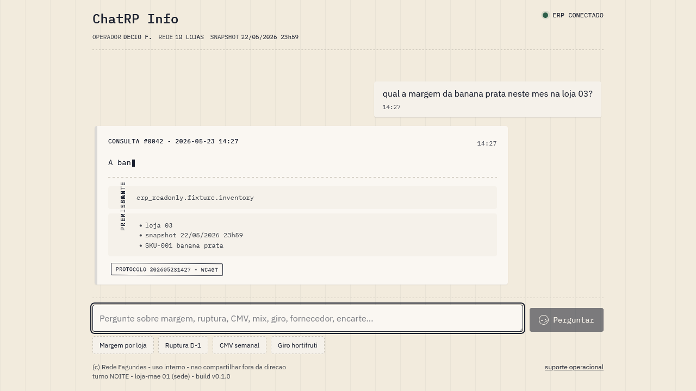

# chatbot-RPinfo

Chat interno para consultar dados do ERP RP Info em modo read-only, com IA real,
auditoria e guardrails LGPD. O projeto nasceu para uso proprio de Decio Fagundes
na operacao do supermercado: responder perguntas de estoque, margem e operacao
com fonte declarada, negativa honesta quando o dado nao existe e nenhum caminho
de escrita automatizada no ERP.



## O que esta pronto

- Backend FastAPI em Python 3.12 com Pydantic v2 e arquitetura modular.
- Camada unica `erp_readonly` para acesso a dados, com allowlist, timeout e limite
  de linhas.
- Autenticacao interna, RBAC por perfil e audit metadado.
- Orquestrador Q&A com Claude Haiku 4.5 como modelo padrao, Sonnet 4.5 apenas por
  escalacao explicita, budget mensal de USD 30 e stub deterministico como fallback
  declarado.
- Guarda-em-camadas V5 do NIVEL-0 ao NIVEL-5: filtro de PII antes do LLM, policy
  contra prompt injection, audit de 19 campos, anti-fallback-silencioso e
  aprovacao cross-security.
- Frontend React 18 + Vite + TypeScript + Playwright consumindo `/api/v1/qa/ask`
  e tratando estados de sucesso, negativa honesta, fallback, escalacao, 422, 403 e
  500.
- Observabilidade LLM com thresholds versionados, templates de relatorio e
  runtime de monitoramento em evolucao na Sprint 003.

## Decisoes principais

| Area | Decisao | Evidencia |
|---|---|---|
| Arquitetura | Monolito modular Python/FastAPI para API e orquestracao IA. | [ADR-0001](docs/adr/0001-arquitetura-aplicacao-ia-readonly-erp.md) |
| Dados ERP | ERP RP Info e fonte primaria; aplicacao so acessa por camada read-only. | [ADR-0002](docs/adr/0002-acesso-dados-erp-readonly-acuracia.md) |
| Seguranca | Contas nominativas, RBAC e auditoria sem payload sensivel bruto. | [ADR-0003](docs/adr/0003-seguranca-autenticacao-lgpd-auditoria.md) |
| LLM | Haiku 4.5 padrao, Sonnet 4.5 opt-in, budget USD 30/mes e sem fallback silencioso. | [ADR-0005](docs/adr/0005-llm-provider.md) |
| Frontend | React 18 + Vite + TypeScript + Playwright em `src/frontend/`. | [ADR-0006](docs/adr/0006-stack-frontend.md) |
| Observabilidade | Promocao do alerta `monitorar-custo-llm` para runtime com cron e relatorios. | [ADR-0007](docs/adr/0007-promocao-alerta-monitorar-custo-llm.md) |
| Retencao | Audit metadado retido por 5 anos com purge futuro e base legal cumulativa. | [ADR-0008](docs/adr/0008-retencao-formal-audit-metadado-5-anos.md) |

## Dados em testes e exemplos

Todos os identificadores que aparecem em testes, fixtures, prompts ou documentacao
deste repositorio sao sinteticos ou pseudonimizados. Eles existem para validar
regras de bloqueio e redacao de PII no orquestrador V5 e para demonstrar fluxos
do chatbot; nenhum identificador refere-se a pessoa fisica real.

Emails de exemplo, quando usados em fixtures ou documentacao, devem usar dominios
reservados pela RFC 2606, como `example.com`, `example.org`, `example.net` ou
`test.invalid`.

## Como rodar

O passo-a-passo esta em [docs/getting-started.md](docs/getting-started.md).
Resumo:

```powershell
cd C:\ProjetoRP\chatbot-RPinfo
.\.venv\Scripts\python.exe -m pip install -e ".[dev]"
$env:USE_STUB_DETERMINISTICO = "true"
$env:INTERNAL_AUTH_PREVENCAO_TOKEN = [guid]::NewGuid().ToString("N")
.\.venv\Scripts\python.exe -m uvicorn chatbot_rpinfo.main:app --reload
```

Em outro terminal:

```powershell
cd C:\ProjetoRP\chatbot-RPinfo\src\frontend
npm install
npm run dev
```

## Leitura para avaliacao tecnica

- [Arquitetura](docs/architecture.md) - componentes, fluxo Q&A, V5 e observabilidade.
- [ADRs navegaveis](docs/adrs-index.md) - indice das decisoes arquiteturais.
- [CHANGELOG](CHANGELOG.md) - entregas por sprint.
- [Material didatico AI Engineering](case-study/aprendizados/2026-05_ai-engineering-qa-orchestrator-decio.md) - explicacao do Q&A com LLM real.
- [Material didatico ML Engineering](case-study/aprendizados/2026-05_ml-engineering-qa-orchestrator-decio.md) - como evoluir o chatbot com eval, drift e canary.

## Fronteiras de seguranca e LGPD

- A Fase 1 e uso proprio de Decio contra o ERP do proprio supermercado.
- A Fase 2 B2B continua bloqueada. Ela exige novo parecer LGPD dedicado, DPA
  Enterprise, RIPD por cliente, DPO formal, contratos operador, nova LIA, politica
  de privacidade publica e controles adicionais.
- Segredos reais ficam fora do repositorio. Este README cita apenas nomes de
  variaveis de ambiente e paths de documentacao.

## Autor e licenca

Autor: Decio Fagundes.

Licenca: a definir antes da publicacao publica final, junto com o resultado do
security review S3-C11.
