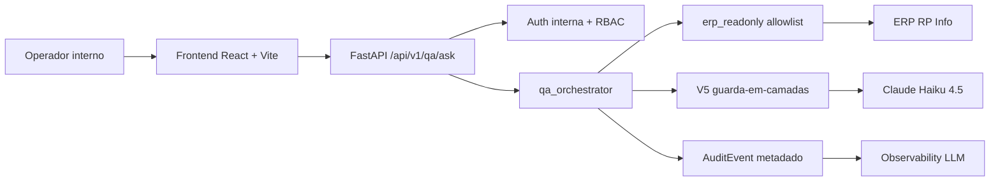

# Architecture

O chatbot-RPinfo e uma aplicacao interna de Q&A operacional sobre dados do ERP
RP Info. A arquitetura foi desenhada para tres prioridades: leitura segura do
ERP, resposta honesta quando o dado nao existe e governanca forte antes de
qualquer uso externo.

## Visao geral

## Backend FastAPI

O backend fica em `src/backend/chatbot_rpinfo` e expõe a aplicacao FastAPI por
`chatbot_rpinfo.main:app`. A ADR-0001 fixa Python 3.12, FastAPI 0.115,
Pydantic v2 e monolito modular. A API inclui controllers de health, auth,
ERP read-only, audit e Q&A.

Contrato principal:

- `POST /api/v1/qa/ask`
- Headers internos: `X-Internal-Username`, `X-Internal-Token`,
  `Idempotency-Key`
- Entrada: pergunta em linguagem natural.
- Saida: resposta com `answer_type`, fonte, premissas, motivo de insuficiencia
  quando houver e metadados LLM quando aplicavel.

## ERP read-only

A ADR-0002 proibe escrita automatizada no ERP. O acesso passa pela camada
`erp_readonly`, que centraliza allowlist de queries, timeout, limite de linhas e
fonte declarada na resposta. O chatbot nao corrige ERP, nao replica a base
operacional como fonte primaria e nao consulta tabelas fora do caminho
allowlistado.

## qa_orchestrator e LlmRouter

O `qa_orchestrator` faz o pipeline:

1. Autentica usuario e perfil.
2. Classifica a intent de forma deterministica.
3. Bloqueia perguntas com identificadores sensiveis.
4. Resolve a query allowlistada no `erp_readonly`.
5. Chama o provider LLM quando a intent e os dados permitem.
6. Retorna resposta com fonte e premissas ou negativa honesta.
7. Registra audit metadado.

A ADR-0005 define Claude Haiku 4.5 como modelo padrao e Sonnet 4.5 apenas por
escalacao explicita. O LlmRouter implementa a regra anti-fallback-silencioso:
falha do Haiku nao vira Sonnet automaticamente. O sistema volta para resposta
insuficiente ou stub deterministico com sinal explicito.

## V5 guarda-em-camadas

A V5 e o controle de seguranca de IA aplicado ao Q&A real:

| Nivel | Funcao | Evidencia |
|---|---|---|
| NIVEL-0 | Stub deterministico, intent classifier e fallback explicito. | `prompts/qa_orchestrator_v0.2.0.md` |
| NIVEL-1 | PII boundary antes do LLM e recall mask no output. | `src/backend/chatbot_rpinfo/domain/policies/` |
| NIVEL-2 | Content policy contra prompt injection e jailbreak. | `content_policy.py` |
| NIVEL-3 | Audit metadado de 19 campos por chamada. | `observability/llm/qa_orchestrator_trace.yaml` |
| NIVEL-4 | Anti-fallback-silencioso e testes dedicados. | `tests/backend/test_llm_router_no_silent_fallback.py` |
| NIVEL-5 | Handoff cross-security aprovado com mitigacoes. | `handoffs/2026-05-22_security-engineer-senior_para_ai-engineer-senior_guarda-em-camadas-cross-security-resposta.md` |

Para Fase 1, os pareceres LGPD autorizam uso proprio com ressalvas. Para Fase 2
B2B, o bloqueio permanece ativo ate cumprir os pre-requisitos juridicos.

## Observabilidade

A observabilidade LLM tem tres pecas:

- `observability/llm/thresholds.yaml`: cinco thresholds de custo, latencia,
  cache e fallback.
- `observability/llm/qa_orchestrator_trace.yaml`: contrato dos campos de audit
  consumidos pelos relatorios.
- `observability/llm/templates/`: relatorios continuous 15min, weekly trend e
  monthly deep-dive.

A ADR-0007 promove o alerta `monitorar-custo-llm` para runtime real na Sprint
003, com cron 15min, weekly trend, monthly deep-dive, canal de alerta para PM e
Direcao, e plano de reversao se houver ruido.

## Frontend React + Vite

A ADR-0006 fixa `src/frontend/` com React 18, Vite 5, TypeScript strict, ESLint e
Playwright. A interface S3-C02 cobre o fluxo Q&A e os estados esperados:
empty, loading, success, escalated, fallback, CG-05, 422, 403 e 500.

Evidencias finais S3-C02:

- Screenshots: `equipe/frontend-senior/screenshots/S3-C02/`.
- QA v4 reduzida: `equipe/qa-senior/gate-resultados/S3-C02_v4_reduzida.md`.
- Aceite Gate 2 PM: `equipe/pm-senior/aceites/2026-05-25_sprint-003_cand-S3-C02_gate-2.md`.

## LGPD e publicacao

Os pareceres relevantes sao:

- `equipe/security-lgpd/pareceres/2026-05-22_parecer-lgpd-adr-0005-llm.md`
- `equipe/security-lgpd/pareceres/2026-05-22_parecer-lgpd-fase-1-uso-proprio.md`
- `equipe/security-lgpd/pareceres/2026-05-22_parecer-lgpd-fase-1-uso-proprio-rev2.md`
- `equipe/security-lgpd/pareceres/2026-05-23_parecer-lgpd-adr-0008-retencao-audit-5-anos.md`

Eles sustentam a Fase 1 e deixam claro que publicacao ou uso B2B nao e
automatico. A Sprint 003 S3-C11 executa security review pre-portfolio antes do
push publico final.
